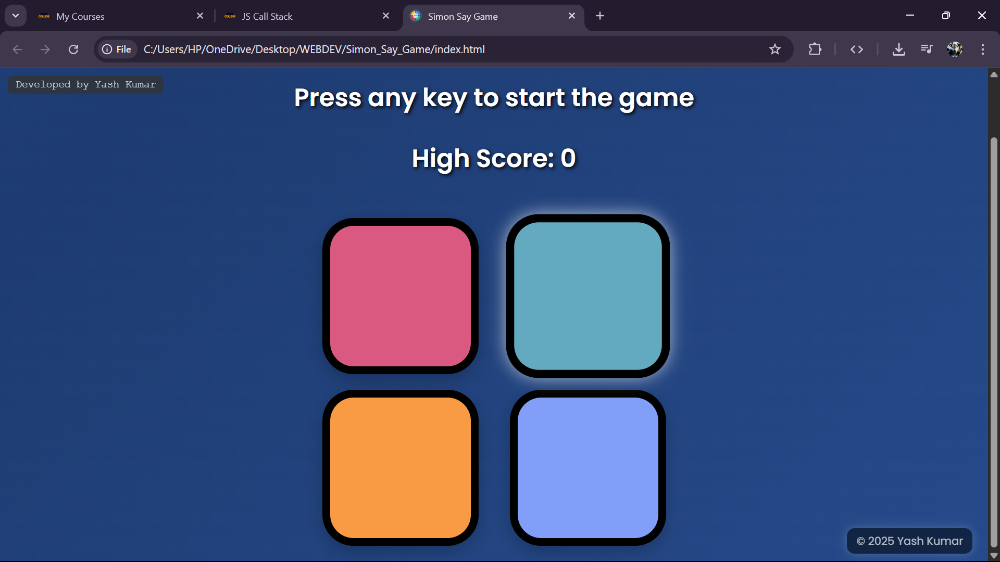

# 🎮 Simon Says Game

An interactive and colorful version of the classic **Simon Says** game, built using **HTML**, **CSS**, and **JavaScript**. This game tests your memory and attention as you try to follow an increasing pattern of colors. Keep playing and try to beat your **high score**!

---

## 🖼️ Preview

<!-- Replace with actual image path if uploaded -->

---

## 🚀 Features

- 🎨 Four-color animated buttons
- 🧠 Pattern-based memory gameplay
- 🏆 High score tracking
- ✨ Stylish responsive UI with background animation
- 🖱️ Click-based input + keyboard to start

---

## 🛠️ Technologies Used

- HTML5
- CSS3 (with transitions and animation)
- JavaScript (DOM manipulation + game logic)

---

simon-says-game/
│
├── index.html          # Main HTML page
├── style.css           # Styling for game & animations
├── app.js              # Game logic
└── README.md           # Project info

👨‍💻 Developed By
Yash Kumar
💡 Passionate about web development and interactive JavaScript projects.

